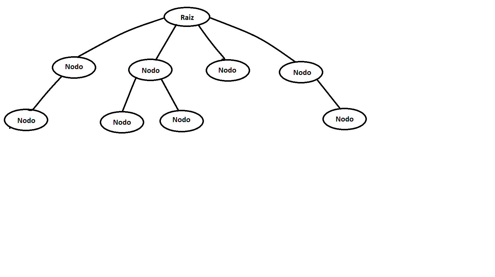
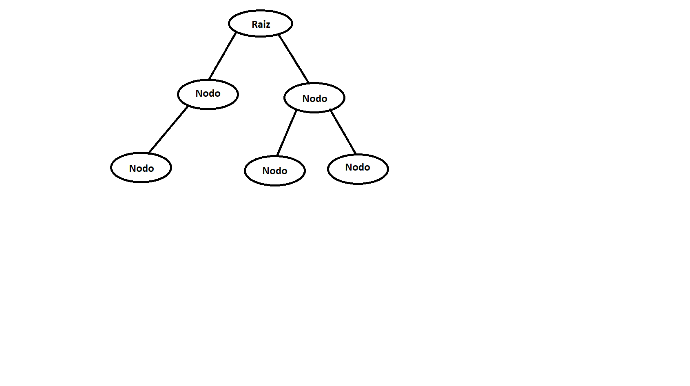

# TDA ABB

## Repositorio de Santiago Henseler - 110732 - shenseler@fi.uba.ar

- Para compilar:

```bash
make pruebas_alumno
```

- Para ejecutar:

```bash
./pruebas_alumno
```

- Para ejecutar con valgrind:
```bash
make valgrind-alumno
```
---
## Explicación arboles

- Arboles: Un arbol es un T.D.A. (tipo de dato abstracto) conformado por una raiz y distintos nodos dipuestos de forma tal que forman un arbol. A su vez existen muchos tipos de arboles, algunos mas eficientes que otros, distintas cantidades de hijos e implementaciones, que se adaptan según cada problema.

<div align="center">
    
</div> 

-Arboles binarios:  Es una de las implementaciones del T.D.A. arbol, cuyos nodos unicamente tienen 2 hijos y estan ordenados arbitrariamente si seguir ninguna normal.

<div align="center">
    
</div> 

- Arboles binarios de Busqueda(A.B.B.): Es una mejora de la implementación de arboles binarios donde los nodos siempre estan ordenados por una condición en particular. Por ejemplo para esta impementación los elementos mayores se ubican a la derecha de los nodos, mientras que los menores a la izquierda, pero podria haber sido al revez y seguiria siendo un  A.B.B. .  Como esta ordenado nos facilita optimizar mucho la mayoria de las operaciones a realizar con él.

<div align="center">
    
</div> 

## Implementación A.B.B.
Implemente el arbol de la siguiente manera: 

```c
struct abb {
	nodo_abb_t *nodo_raiz;
	abb_comparador comparador;
	size_t tamanio;
};
```
El arbol necesita tener la función de comparador, pasada por el usuario, porque el arbol al ser un T.D.A. almacena cualquier tipo de datos. Entonces para poder funcionar correctamente y hacer constantemente comparaciones necesitamos saber como comparar estos datos almacenados por el usuario.

A la hora de implementar los nodos enlazados del arbol,donde se van a almacenar los datos. Lo hice de la siguiente manera:
```c
struct nodo_abb {
	void *elemento;
	struct nodo_abb *izquierda;
	struct nodo_abb *derecha;
};
```

Para poder implementar todas las funcionalidades del A.B.B. hice uso de la recursividad. Porque es mucho más facil e intuitivo "subir" y "bajar" por las ramas del arbol recorriendolas. Ademas hacen más lejible la implementación y optimizar aún más ciertas operaciónes. Para ello cree 3 librerias (recorrido.h, funcionaildades.h y borrador.h), tanto para facilitar la lectura del codigo como para encontrar errrores de manera más sencilla. En estas librerias implemente casi todas las funcionalidades recursivamente. Al ser un problema tratado recursivamente de tipo "divide y conquistaras" voy a utilizar el teorema maestro `T(n)= AT(n/b) + o(x)` para definir la complejidad de los algoritmos.

## Funcionalidades 

- `abb_crear()` : crea el A.B.B. e inizializa todo en 0.

- `abb_insertar()` : recorre el arbol comparando si el elemento a colocar es mayor o menor al actual y decide si ir hacia la derecha o izquierda según ese resultado. Cuando llega a una rama vacia (NULL) reserva memoria para el nuevo nodo y lo inserta en esa posición. Para mi implementación decidi que si un elemento es igual lo añiado a la izquierda.

*analisis de complejidad*:

  ```c
	if (actual == NULL) {
		struct nodo_abb *nuevo_nodo = calloc(1, sizeof(struct nodo_abb)); --> 1
		if (nuevo_nodo == NULL)
			return NULL;
		*insertado = true; --> 1
		nuevo_nodo->elemento = elemento; --> 1
		arbol->tamanio++; --> 1
		return nuevo_nodo;
	}
	int comparador = arbol->comparador(actual->elemento, elemento);
	if (comparador >= 0) {
		actual->izquierda = insertar_recursivo(arbol, actual->izquierda, elemento, insertado);
	} else {
		actual->derecha = insertar_recursivo(arbol, actual->derecha, elemento, insertado);
	}
```

Planteo la siguiente ecuación: `T(n) = 1T(n/2) + O(1)`. Entonces tiene una complejidad de log(n) porque: `c = n^logb(a) = n^log2(1) = n^0 = 1 ==> c = o(1)`.

- `abb_buscar()` : recorre el arbol comparando si el elemento es mayor o menor al actual y decide si ir hacia la derecha o izquierda según ese resultado. Cuando el elemento actual es igual al buscado lo devuelve.
  
*analisis de complejidad*:

```c
	if (arbol->comparador(actual->elemento, elemento) == 0) {
		return actual;
	} else if (arbol->comparador(actual->elemento, elemento) > 0) {
		if (actual->izquierda == NULL)
			return NULL;
		return buscar(arbol, actual->izquierda, elemento);
	}

	if (actual->derecha == NULL)
		return NULL;
	return buscar(arbol, actual->derecha, elemento);
```

Planteo la siguiente ecuación: `T(n) = 1T(n/2) + O(1)`. Entonces tiene una complejidad de log(n) porque: `c = n^logb(a) = n^log2(1) = n^0 = 1 ==> c = o(1)`.

- `abb_quitar()` : recorre el arbol comparando si el elemento es mayor o menor al elemento a eliminar y decide si ir hacia la derecha o izquierda según ese resultado. Cuando el elemento actual es igual al buscado llama a la funcion `reacomodar_al_quitar()` que verifica como es la distribucion de los nodos hijos del elemento eliminado y los reacomoda siguiendo una serie de parametros para que el arbol siga manteniendo su coherencia.
  
*analisis de complejidad*:

```c
	int comparador = arbol->comparador(actual->elemento, elemento);
	if (comparador == 0) {
		if (arbol->tamanio == 1) {
			almacenador->elementos = actual->elemento; --> 1
			almacenador->total = 1; --> 1
			free(actual); --> 1
			return NULL;
		}
		almacenador->elementos = actual->elemento;--> 1
		almacenador->total = 1;--> 1
		return reacomodar_al_quitar(arbol, actual);--> o(1) | o(n)
	}
	if (comparador > 0) {
		actual->izquierda = quitar_recursivo(arbol, elemento, actual->izquierda, almacenador);
	} else {
		actual->derecha = quitar_recursivo(arbol, elemento, actual->derecha, almacenador);
	}
	return actual;
}
```

Planteo la siguiente ecuación: `T(n) = 1T(n/2) + O(1)`. Entonces tiene una complejidad de log(n) porque: `c = n^logb(a) = n^log2(1) = n^0 = 1 ==> c = o(1)`. <=> el nodo a borrar tiene un solo hijo o ninguno. Porque si tiene 2 hijos la complejidad de la funcion `reacomodar_al_quitar()` se transforma en o(n) => `T(n) = log(n) + O(n)` y su complejidad escala a o(n).

- `abb_destruir()` y `abb_destruir_todo()`: Ambas funciones llaman a `destruir_todo_iterativa()` que recorre recursivamente el arbol de manera postorden haciendo `free()` de cada nodo y ademas en el caso de `abb_destruir_todo()` le aplica una funcion pasada por parametro a cada elemento del arbol.

*analisis de complejidad*:
  ```c
{
	if (actual == NULL)
		return;
	if (destructor != NULL)
		destructor(actual->elemento); --> 1
	destruir_todo_iterativa(actual->izquierda, destructor);
	destruir_todo_iterativa(actual->derecha, destructor);
	free(actual);
}
```
En este caso la complejidad de esta función es o(n) ya que tiene que recorrer todo el arbol y vaciar la memoria uno por uno.

- `abb_con_cada_elemento()` y `abb_recorrer()`: Ambas funciones se manejan parecido. Recorren el arbol de manera preorder, inorder o postorden segun se lo indique el usuario y sigue recorriendolo mientras la funcion pasada por parametro sigua devolviendo True. Una vez termine de recorrer devuelve la cantidad de iteraciónes. Ademas la función `abb_recorrer()` llena un array con los elementos que recorre. Para implementar esto cree un nuevo struct llamado almacenador donde guardo los elementos pedidos y la cantidad de elementos iterados.
```c
  typedef struct almacenador {
	void **elementos;
	size_t cantidad;
	size_t total;
} almacenador_t; 
```
*analisis de complejidad*:

```c
	if (*recorridos == maximo)
		return false;
	if (actual == NULL)
		return true;
	(*recorridos)++;
	if (funcion(actual->elemento, aux) == false)
		return false;
	if (recorrido_iterativo_preorden(actual->izquierda, funcion, aux, recorridos, maximo) == false)
		return false;

	return recorrido_iterativo_preorden(actual->derecha, funcion, aux, recorridos, maximo);
```
En este caso la complejidad de esta función es o(n) ya que tiene que recorrer uno por uno todo el arbol.

Los analisis de complejidad se cumplen considerando que el arbol se mantiene balanceado porque sino, degenera en lista y las operaciones que no son O(n) pasarian a serlo.
